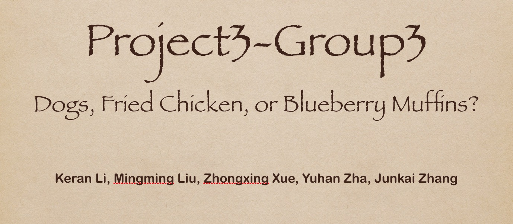
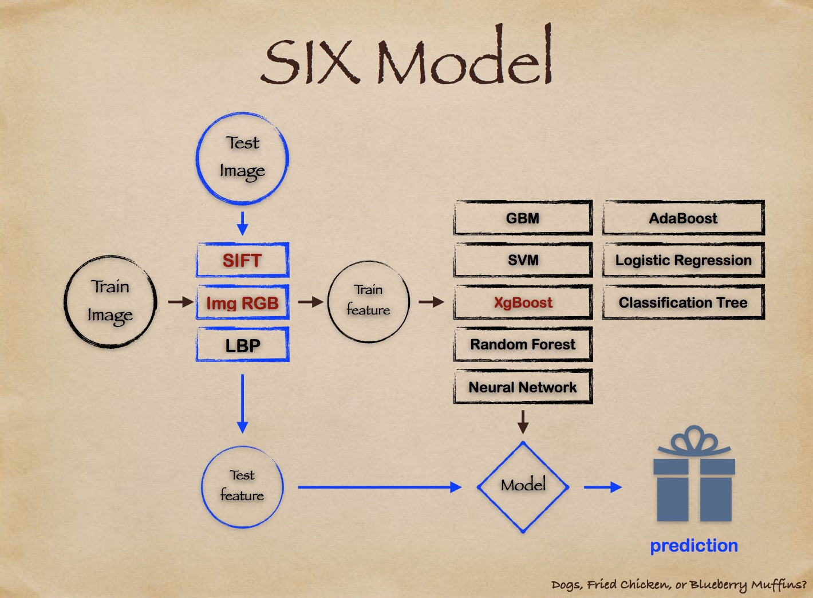
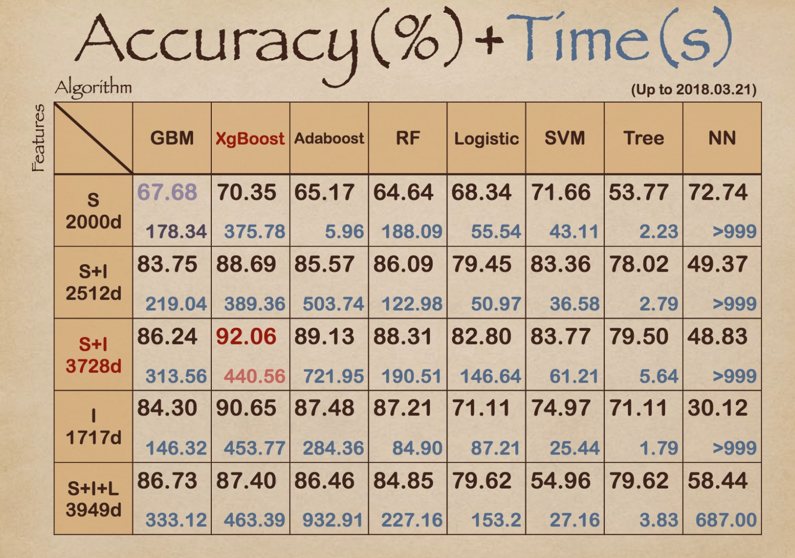
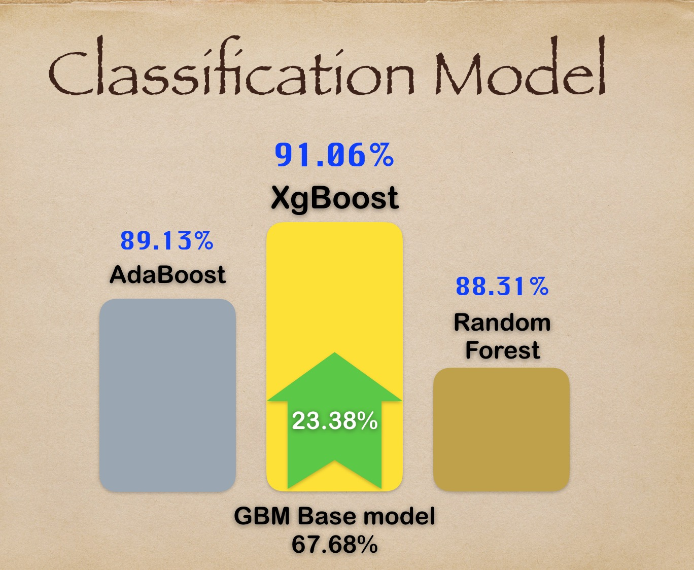
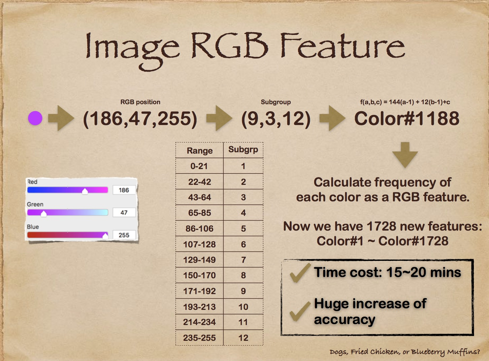
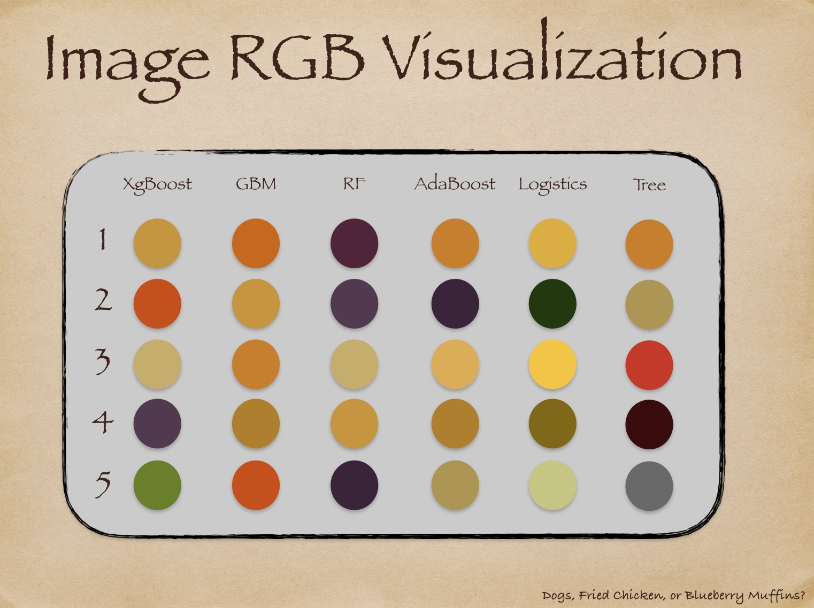

# Project: Dogs, Fried Chicken or Blueberry Muffins?



### [Full Project Description](doc/project3_desc.md)

Term: Spring 2018

+ Group 3
+ Team members
	+ Keran Li
	+ Mingming Liu
	+ Zhongxing Xue
	+ Yuhan Zha
	+ Junkai Zhang

+ Project summary: 
In this project, we improved a classification baseline model for images of dogs, fried chickens and blueberry muffins in terms of ruing time cost and prediction accuracy. The baseline model for comparison uses Gradient Boosting Machine (GBM) with decision stumps on 2000 SIFT features. Our group uses 3 image feature selection models, including SIFT, RGB, LBP and the arbitrary combinations of them, and 8 classification models, including GBM, SVM, XgBoost, Random Forest, Neural Network, AdaBoost, Logistic Regression and Classification Trees. The procedure as follows:



The time consuming and accuracy of our models as follows:


We chose SIFT+ Image RGB and XgBoost as our proposed model:



We interpreted Image RGB feature and selected the top 5 significant varible for each model, which indicates the different colors for each model:



	
**Contribution statement**: ([default](doc/a_note_on_contributions.md))

Zhongxing Xue organized the team work and discussion, and led the whole team to make analysis and summary. ZX put forward the Image RGB feature, and wrote code to calculate them. ZX was also responsible for GBM model. Zhongxing was the presenter of the group, and he designed the powerpoint.

Keran Li: coded the Neural Network Model, Logistic Regression Model and their cross validation in R. Coded the LBP and PCA feature selection function. Wrote the readme file for the project.

Mingming Liu: coded the Adaboosting Model and Randomforest Model and their cross validation in R. Responsible for organized the test and train document.

Junkai Zhang: coded the cross validation and grid search procedure of XgBoost Model in R and prepared plots for the powerpoint.

Following [suggestions](http://nicercode.github.io/blog/2013-04-05-projects/) by [RICH FITZJOHN](http://nicercode.github.io/about/#Team) (@richfitz). This folder is orgarnized as follows.

```
proj/
├── lib/
├── data/
├── doc/
├── figs/
└── output/
```

Please see each subfolder for a README file.
