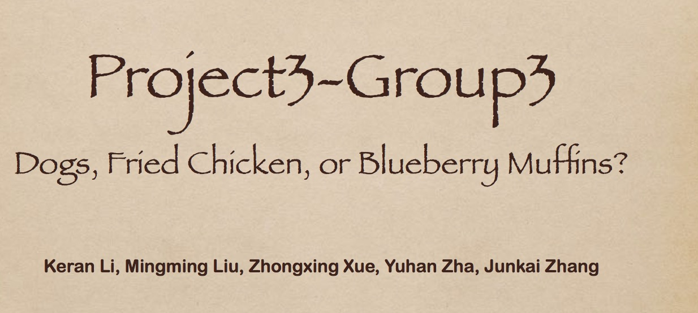
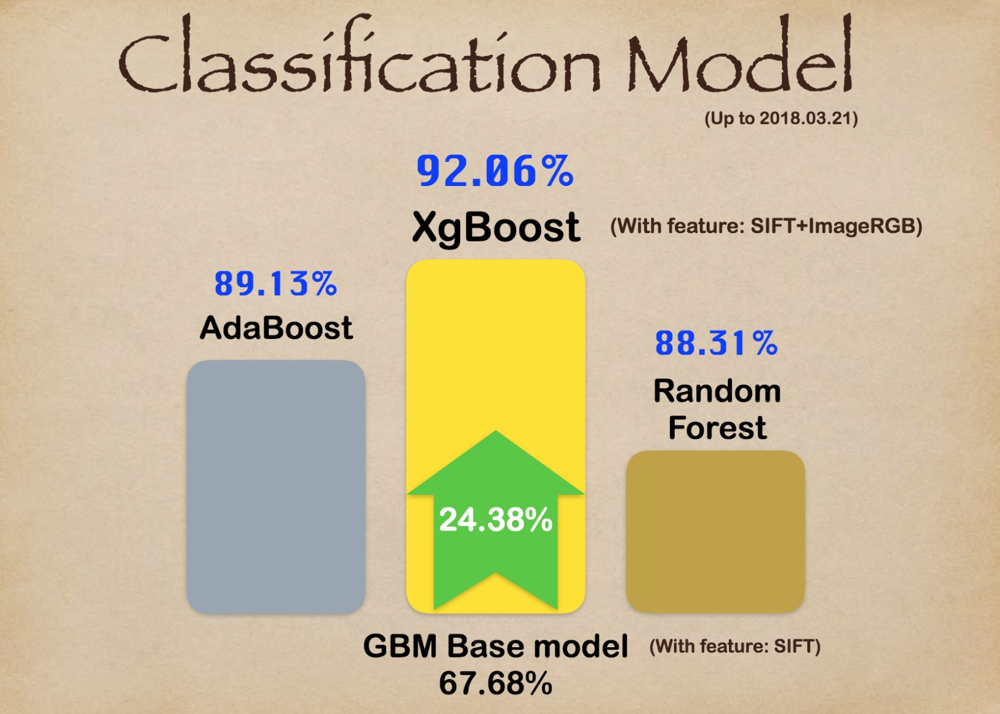

# Project: Dogs, Fried Chicken or Blueberry Muffins?



### [Full Project Description](doc/project3_desc.md)

Term: Spring 2018

+ Group 3
+ Team members
	+ Keran Li
	+ Mingming Liu
	+ Zhongxing Xue
	+ Yuhan Zha
	+ Junkai Zhang

+ Project summary: In this project, we improved a classification baseline model using SIFT+GBM for images of dogs, fried chickens and blueberry muffins interms of ruing time cost and prediction accracy. The baseline model for comparison uses Gradient Boosting Machine (GBM) with decision stumps on 5000 SIFT features. Our group uses 3 image feature selection models, including SIFT, RGB, LBP and the arbitrary 2 combinations, and 8 classification moodels. The procedure as follows:


The time consuming and accuracy of our models as follows:


We chose SIFT+RGB and XgBoost as our proposed model:



We interpreted RGB feature and selected the top 5 significant varible for each model, which indicates the different colors for each model:


	
**Contribution statement**: ([default](doc/a_note_on_contributions.md)) All team members contributed equally in all stages of this project. All team members approve our work presented in this GitHub repository including this contributions statement. 

Following [suggestions](http://nicercode.github.io/blog/2013-04-05-projects/) by [RICH FITZJOHN](http://nicercode.github.io/about/#Team) (@richfitz). This folder is orgarnized as follows.

```
proj/
├── lib/
├── data/
├── doc/
├── figs/
└── output/
```

Please see each subfolder for a README file.
